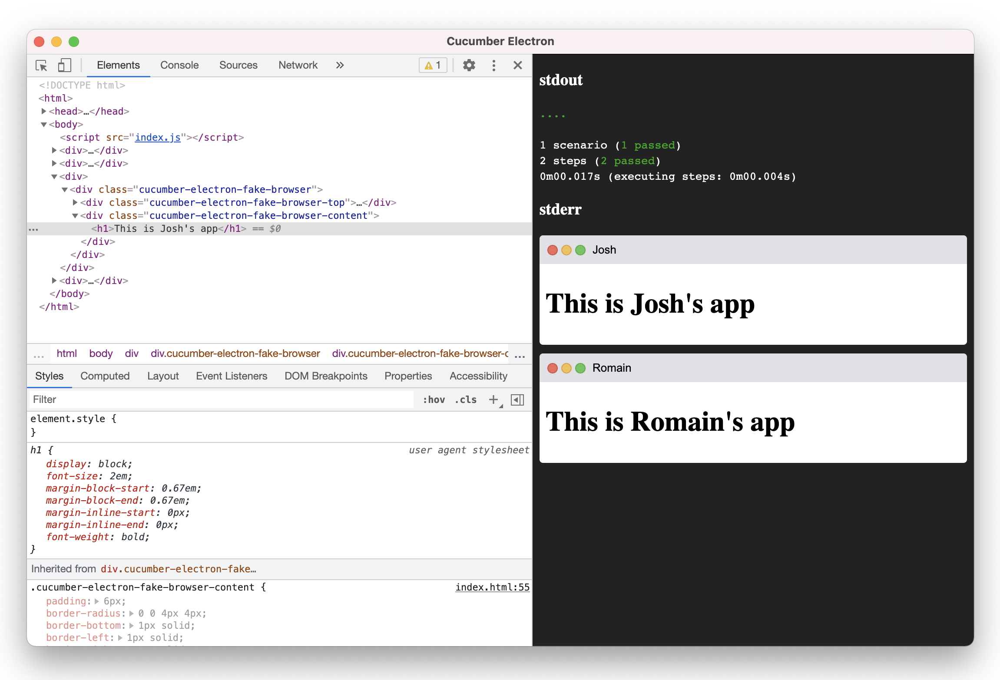

# cucumber-electron

Runs [Cucumber.js](https://github.com/cucumber/cucumber-js) in an [Electron](https://github.com/electron/electron) renderer process. Scenarios have direct access to both a browser DOM and node.js libraries, so they are fast and easy to debug interactively.

[](https://github.com/cucumber/cucumber-electron/actions)

## Install

Both Electron and Cucumber.js need to be installed, they are peer dependencies.
This gives you the option to choose the version you want to use:

    npm install --save-dev electron @cucumber/cucumber @cucumber/electron

## Usage

Cucumber-electron is a wrapper around Cucumber.js, supporting the same
features and command-line options. You should be able to use it on your project
without any changes.

Run cucumber-electron like it was Cucumber.js, for example:

    npx cucumber-electron ./features/your.feature:123

## API

Cucumber Electron provides an API that you can use in your step definitions or hooks.

### App Elements

An app element is a DOM element where you can mount the application or component under test.

```javascript
const { AppElements } = require('@cucumber/cucumber-electron')

Before(function () {
  this.appElements = new AppElements()
})

Given('{word} has an app element', function (name) {
  const appElement = this.appElements.create(document, name)
  
  // Mount a React Component
  ReactDOM.render(<MyComponent />, appElement)
  
  // Mount a Vue component
  new Vue({ el: appElement })
  
  // Vanilla DOM
  appElement.innerHTML = '<h1>Hello World</h1>'
})

After(function () {
  if (!process.env.CUCUMBER_ELECTRON_KEEP_APP_ELEMENTS) {
    // Destroy all app elements after each scenario
    this.appElements.destroyAll()
  }
})
```

In [interactive debugging](#interactive-debugging) mode this will look something like this:



See the [app-elements example](examples/app-elements) for more details.

You can run it like this:

    CUCUMBER_ELECTRON_KEEP_APP_ELEMENTS=1 ./bin/cucumber-electron.js examples/app-elements --interactive

## Interactive Debugging

The `--interactive` (or `-i`) command line switch shows a browser window with chrome dev tools and keeps
the window open after all features have finished running.

The interactive debugger will halt execution on any `debugger` statements, or breakpoints you have set in chrome dev tools.

In interactive mode you can re-run all your scenarios by pressing `CMD-R` (MacOS) or `CTRL-R` (Windows/Linux)
while the browser window has focus.
